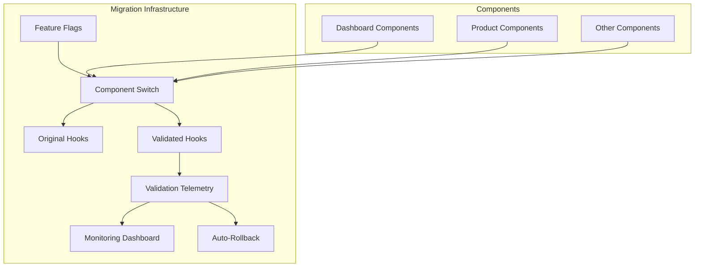

# 🚀 Complete Migration Guide: Validated Hooks with Telemetry

## Overview

This guide provides a comprehensive roadmap for migrating your application from standard hooks to validated hooks with runtime type safety, telemetry monitoring, and gradual rollout capabilities.

## Architecture Overview



## ✅ What Has Been Implemented

### 1. **Core Infrastructure**

#### Feature Flags System (`/src/modules/core/utils/feature-flags.ts`)

- Global enable/disable for validated hooks
- Percentage-based rollout (A/B testing)
- Component-specific activation
- Debug mode with visual indicators
- Environment variable configuration
- Auto-rollback on high error rates

#### Validation Telemetry (`/src/modules/core/monitoring/validation-telemetry.ts`)

- Real-time error tracking
- Performance monitoring (P50, P95, P99)
- Success/failure rate calculation
- Fallback usage tracking
- Error categorization by type and context
- Auto-rollback trigger on threshold breach
- Comprehensive reporting API

### 2. **Validated Hooks**

#### Dashboard Hooks (`/src/modules/dashboard/hooks/data/use-dashboard-data-validated.ts`)

- `useDashboardMetricsValidated` - Sales metrics with validation
- `useFinancialMetricsValidated` - Financial data validation
- `useChartDataValidated` - Chart data point validation
- `useShippingDifferenceValidated` - Shipping metrics validation
- `useDashboardDataValidated` - Parallel data fetching with fallback
- `usePrefetchDashboardDataValidated` - Adjacent period prefetching

#### Product Hooks (`/src/modules/produtos/hooks/data/use-produtos-data-validated.ts`)

- `useProdutoMetricsValidated` - Product metrics validation
- `useProdutosListValidated` - Product list validation
- `useStockDistributionValidated` - Stock distribution validation
- `useProdutosReposicaoValidated` - Reorder products validation
- `useProdutoDataValidated` - Complete product data
- `useProdutoByIdValidated` - Single product validation
- `useAllProdutoDataValidated` - Parallel product data fetching
- `useSaveProdutoValidated` - Product mutation with validation

### 3. **Component Migration Examples**

#### Dashboard Content Switch (`/src/modules/dashboard/pages/dashboard-vendas/dashboard-content-switch.tsx`)

- A/B testing between original and validated versions
- Runtime version switching in debug mode
- Analytics tracking for version usage
- Visual indicators for active version

#### Dashboard Content Validated (`/src/modules/dashboard/pages/dashboard-vendas/dashboard-content-validated.tsx`)

- Parallel version using validated hooks
- Telemetry integration for monitoring
- Fallback support for validation failures
- Visual health indicators in debug mode

### 4. **Monitoring & Observability**

#### Validation Monitor Dashboard (`/src/app/admin/validation-monitor/page.tsx`)

- Real-time validation health monitoring
- Error rate and success rate visualization
- Performance metrics (avg time, percentiles)
- Top error contexts and types
- Recent error history with details
- Auto-rollback status indicator
- System health indicators (healthy/warning/critical)

### 5. **Migration Automation**

#### Migration Script (`/scripts/migrate-to-validated-hooks.ts`)

- Automated component analysis
- Hook usage detection
- AST-based code transformation
- Import path updates
- Backup creation before migration
- Dry-run mode for preview
- Comprehensive migration reporting

## 📋 Migration Strategy

### Phase 1: Setup & Configuration (✅ Completed)

1. **Install dependencies** (if not already done):

```bash
npm install @babel/parser @babel/traverse @babel/generator @babel/types chalk glob
```

2. **Configure feature flags** in `.env`:

```env
# Enable validated hooks (start with false)
NEXT_PUBLIC_USE_VALIDATED_HOOKS=false

# Enable monitoring
NEXT_PUBLIC_VALIDATION_MONITORING=true

# Enable fallback for graceful degradation
NEXT_PUBLIC_VALIDATION_FALLBACK=true

# Enable debug mode for development
NEXT_PUBLIC_VALIDATION_DEBUG=true

# Rollout percentage (0-100)
NEXT_PUBLIC_VALIDATION_ROLLOUT_PERCENTAGE=0

# Auto-rollback settings
NEXT_PUBLIC_AUTO_ROLLBACK_ENABLED=true
NEXT_PUBLIC_AUTO_ROLLBACK_THRESHOLD=0.1
```

### Phase 2: Analysis & Testing

1. **Analyze your codebase** to identify components using hooks:

```bash
npm run migrate:hooks:analyze
```

This will show:

- Which components use original hooks
- Which hooks are most commonly used
- Which files can be automatically migrated
- Warnings for files requiring manual review

2. **Test validated hooks in isolation**:

```typescript
// Test a single hook first
import { useDashboardMetricsValidated } from '@/modules/dashboard/hooks/data/use-dashboard-data-validated'

// Use in a test component
function TestComponent() {
  const { data, isError, validationErrors } = useDashboardMetricsValidated()

  if (validationErrors?.length > 0) {
    console.error('Validation errors detected:', validationErrors)
  }

  return <div>{/* Component UI */}</div>
}
```

3. **Monitor validation health**:

- Navigate to `/admin/validation-monitor`
- Check error rates and patterns
- Review performance metrics
- Identify problematic contexts

### Phase 3: Gradual Migration

1. **Start with non-critical components**:

```bash
# Preview changes first
npm run migrate:hooks:dry-run -- --component=src/modules/dashboard/components/metric-card.tsx

# Apply migration
npm run migrate:hooks -- --migrate --component=src/modules/dashboard/components/metric-card.tsx
```

2. **Enable for specific components**:

```env
# Enable only for specific components
NEXT_PUBLIC_VALIDATION_ENABLED_COMPONENTS=dashboard-metrics,product-list
```

3. **Use percentage rollout**:

```env
# Start with 10% of users
NEXT_PUBLIC_VALIDATION_ROLLOUT_PERCENTAGE=10
```

4. **Monitor and increase gradually**:

- Check validation monitor dashboard
- Review error rates and performance
- Increase percentage if metrics are good
- 10% → 25% → 50% → 100%

### Phase 4: Production Rollout

1. **Enable globally when confident**:

```env
NEXT_PUBLIC_USE_VALIDATED_HOOKS=true
NEXT_PUBLIC_VALIDATION_ROLLOUT_PERCENTAGE=100
```

2. **Keep monitoring enabled**:

```env
NEXT_PUBLIC_VALIDATION_MONITORING=true
NEXT_PUBLIC_AUTO_ROLLBACK_ENABLED=true
NEXT_PUBLIC_AUTO_ROLLBACK_THRESHOLD=0.05
```

3. **Disable debug mode in production**:

```env
NEXT_PUBLIC_VALIDATION_DEBUG=false
```

## 🛠️ Manual Migration Examples

### Example 1: Simple Hook Migration

**Before:**

```typescript
import { useDashboardMetrics } from '@/modules/dashboard/hooks/data/use-dashboard-data'

function MetricsWidget() {
  const { data, isLoading, error } = useDashboardMetrics()

  if (error) {
    return <div>Error loading metrics</div>
  }

  return <div>{data?.totalRevenue}</div>
}
```

**After:**

```typescript
import { useDashboardMetricsValidated } from '@/modules/dashboard/hooks/data/use-dashboard-data-validated'

function MetricsWidget() {
  const { data, isLoading, isError, validationErrors } = useDashboardMetricsValidated()

  if (isError) {
    // Handle validation errors specifically
    if (validationErrors?.length > 0) {
      console.error('Validation failed:', validationErrors)
      // Could use fallback data or show specific error
    }
    return <div>Error loading metrics</div>
  }

  return <div>{data?.totalRevenue}</div>
}
```

### Example 2: Component with Fallback

**Using fallback data for resilience:**

```typescript
import { useDashboardDataValidated } from '@/modules/dashboard/hooks/data/use-dashboard-data-validated'

function DashboardContent({ cachedData }) {
  const {
    data,
    isLoading,
    validationErrors
  } = useDashboardDataValidated(period, {
    fallbackData: cachedData,
    onValidationError: (errors) => {
      // Log to monitoring service
      console.error('Validation errors:', errors)
      // Track in analytics
      trackEvent('validation_error', {
        count: errors.length,
        context: 'dashboard'
      })
    }
  })

  // Component continues to work with fallback data
  const displayData = data || cachedData

  return (
    <>
      {validationErrors?.length > 0 && (
        <Alert>Using cached data due to validation issues</Alert>
      )}
      <DashboardView data={displayData} />
    </>
  )
}
```

## 🔍 Debugging & Troubleshooting

### Enable Debug Mode

1. **Set environment variable**:

```env
NEXT_PUBLIC_VALIDATION_DEBUG=true
```

2. **Use debug helpers in browser console**:

```javascript
// Switch specific component to validated version
window.switchValidation('dashboard-content', true)

// Switch back to original
window.switchValidation('dashboard-content', false)
```

3. **Check validation telemetry**:

```javascript
// In browser console (when debug mode is on)
const report = ValidationTelemetry.getReport()
console.table(report)
```

### Common Issues & Solutions

#### High Error Rates

- Check `/admin/validation-monitor` for error patterns
- Review top error contexts and types
- Adjust schemas if they're too strict
- Consider using fallback data

#### Performance Degradation

- Check P95 and P99 metrics in monitor
- Optimize validation schemas
- Consider caching validated results
- Use prefetching for adjacent data

#### Auto-Rollback Triggered

- Review error threshold settings
- Check recent deployment changes
- Analyze error patterns in monitor
- Manually re-enable after fixes

## 📊 Monitoring Best Practices

### Key Metrics to Watch

1. **Error Rate**: Should be < 1% in production
2. **Success Rate**: Target > 99%
3. **Average Validation Time**: Should be < 50ms
4. **P95 Time**: Should be < 100ms
5. **Fallback Usage**: Should be minimal (< 0.5%)

### Setting Up Alerts

```typescript
// Example alert configuration
const ALERT_THRESHOLDS = {
  errorRate: 0.02, // Alert if > 2%
  avgTime: 100, // Alert if > 100ms
  fallbackRate: 0.01, // Alert if > 1%
  rollbackTriggered: true, // Alert immediately
}
```

## 🚦 Rollback Procedures

### Automatic Rollback

The system automatically disables validated hooks when:

- Error rate exceeds threshold (default 10%)
- After minimum sample size (100 validations)

### Manual Rollback

If issues are detected:

1. **Immediate rollback**:

```env
NEXT_PUBLIC_USE_VALIDATED_HOOKS=false
```

2. **Component-specific rollback**:

```env
NEXT_PUBLIC_VALIDATION_ENABLED_COMPONENTS=
```

3. **Investigate issues**:

- Check validation monitor
- Review error logs
- Analyze telemetry data
- Fix validation schemas

## 🎯 Success Criteria

Your migration is successful when:

- ✅ All components migrated to validated hooks
- ✅ Error rate < 1% consistently
- ✅ Performance metrics within targets
- ✅ No fallback usage in normal operation
- ✅ All tests passing
- ✅ Monitoring shows healthy status
- ✅ Team trained on new patterns

## 📚 Additional Resources

### Documentation

- [Zod Documentation](https://zod.dev/)
- [React Query Documentation](https://tanstack.com/query)
- [Feature Flags Best Practices](https://martinfowler.com/articles/feature-toggles.html)

### Internal Documentation

- /src/modules/dashboard/schemas/ e /src/modules/produtos/schemas/ -- Schemas de validação
- /src/modules/*/hooks/data/use-*-validated.ts -- Implementações dos hooks validados
- `/src/modules/core/monitoring/validation-telemetry.ts` - Telemetry system
- `/scripts/migrate-to-validated-hooks.ts` - Migration script

### Support

- Create issues in project repository
- Check validation monitor for real-time status
- Use debug mode for detailed information
- Review telemetry exports for analysis

## 🔄 Continuous Improvement

1. **Regular Reviews**: Weekly validation health checks
2. **Schema Updates**: Keep schemas aligned with API changes
3. **Performance Optimization**: Monitor and optimize slow validations
4. **Documentation**: Update patterns as they evolve
5. **Team Training**: Share learnings and best practices

---

**Remember**: The goal is not just to add validation, but to improve reliability, catch errors early, and provide better user experience through graceful degradation and comprehensive monitoring.
