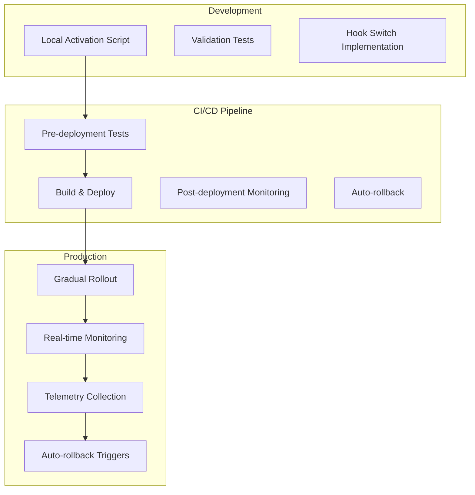

# 🚀 Validated Hooks Production Rollout Guide

## 📋 Executive Summary

This guide documents the complete production rollout process for validated hooks with Zod runtime validation. The implementation follows a gradual rollout strategy with comprehensive monitoring and automatic rollback capabilities.

## 🎯 Implementation Status

### ✅ Completed (Phases 1-5)

1. **CI/CD Configuration** - GitHub Actions workflow for validation testing
2. **E2E Tests** - Comprehensive Playwright tests for validation scenarios
3. **Local Activation** - Scripts for local development environment setup
4. **Staging Rollout** - Gradual rollout management for staging
5. **Production Deployment** - Automated deployment with monitoring

### 🏗️ Architecture Overview



## 📦 Key Components

### 1. Hook Switch System (`use-*-switch.ts`)

- Dynamically switches between original and validated hooks
- Feature flag controlled
- Automatic fallback on errors
- Telemetry integration

### 2. Validation Monitor (`/admin/validation-monitor`)

- Real-time dashboard
- Error tracking
- Performance metrics
- Manual rollback controls

### 3. CI/CD Workflows

- `.github/workflows/validation-tests.yml` - Validation testing
- `.github/workflows/deploy.yml` - Production deployment

### 4. Activation Scripts

- `scripts/activate-validation-local.ts` - Local environment
- `scripts/rollout-validation-staging.ts` - Staging rollout

## 🚦 Rollout Strategy

### Stage 1: Canary (10%)

```bash
# Deploy with 10% rollout
gh workflow run deploy.yml -f rollout_percentage=10
```

### Stage 2: Early Adopters (25%)

```bash
# After 24 hours of stable operation
gh workflow run deploy.yml -f rollout_percentage=25
```

### Stage 3: Half Traffic (50%)

```bash
# After 48 hours of stable operation
gh workflow run deploy.yml -f rollout_percentage=50
```

### Stage 4: Majority (75%)

```bash
# After 72 hours of stable operation
gh workflow run deploy.yml -f rollout_percentage=75
```

### Stage 5: Full Rollout (100%)

```bash
# After 1 week of stable operation
gh workflow run deploy.yml -f rollout_percentage=100
```

## 📊 Monitoring & Alerts

### Key Metrics to Monitor

1. **Error Rate**

   - Threshold: < 1%
   - Alert: > 2%
   - Auto-rollback: > 5%

2. **Performance Impact**

   - Threshold: < 5% degradation
   - Alert: > 10% degradation
   - Auto-rollback: > 20% degradation

3. **Validation Failures**
   - Expected: < 0.1%
   - Alert: > 0.5%
   - Auto-rollback: > 1%

### Monitoring Commands

```bash
# View real-time monitoring dashboard
npm run validation:monitor

# Check validation status
curl https://your-app.com/api/monitoring/validation/status

# View telemetry data
curl https://your-app.com/api/monitoring/validation/metrics
```

## 🔄 Rollback Procedures

### Automatic Rollback

Triggered automatically when:

- Error rate exceeds 5%
- Performance degradation > 20%
- Multiple validation failures

### Manual Rollback

#### Via GitHub Actions

```bash
gh workflow run deploy.yml -f force_rollback=true
```

#### Via Monitoring Dashboard

1. Navigate to `/admin/validation-monitor`
2. Click "Manual Rollback"
3. Confirm action

#### Emergency Rollback

```bash
# Direct environment variable update
vercel env pull
echo "NEXT_PUBLIC_VALIDATION_ENABLED=false" >> .env.production
vercel deploy --prod
```

## 🧪 Testing Procedures

### Pre-deployment Tests

```bash
# Run all validation tests
npm run validation:test:integration

# Check specific scenarios
npm run test:e2e -- --grep "validation"

# Performance impact test
npm run test:performance -- --validation
```

### Post-deployment Verification

```bash
# Health check
curl -f https://your-app.com/api/health

# Validation status
curl https://your-app.com/api/monitoring/validation/status

# Error metrics
curl https://your-app.com/api/monitoring/validation/metrics
```

## 📝 Configuration Reference

### Environment Variables

```env
# Core Configuration
NEXT_PUBLIC_VALIDATION_ENABLED=true
NEXT_PUBLIC_VALIDATION_PERCENTAGE=10

# Monitoring
VALIDATION_ERROR_THRESHOLD=10
VALIDATION_PERFORMANCE_THRESHOLD=100
VALIDATION_TELEMETRY_ENABLED=true
VALIDATION_AUTO_ROLLBACK=true

# Alerts (Optional)
VALIDATION_ALERT_WEBHOOK=https://example.com/slack/webhook
VALIDATION_ALERT_EMAIL=team@example.com
```

### Feature Flags

```json
{
  "validation": {
    "enabled": true,
    "percentage": 10,
    "features": {
      "dashboard": true,
      "produtos": true,
      "reports": false,
      "settings": false
    }
  }
}
```

## 🐛 Troubleshooting

### Common Issues

#### 1. High Error Rate After Deployment

```bash
# Check error logs
npm run logs:validation

# Identify failing hooks
curl https://your-app.com/api/monitoring/validation/errors

# Rollback if needed
gh workflow run deploy.yml -f force_rollback=true
```

#### 2. Performance Degradation

```bash
# Check performance metrics
curl https://your-app.com/api/monitoring/validation/performance

# Compare with baseline
npm run performance:compare

# Adjust rollout percentage
gh workflow run deploy.yml -f rollout_percentage=5
```

#### 3. Validation Failures

```bash
# View validation errors
curl https://your-app.com/api/monitoring/validation/failures

# Check specific hook
npm run debug:hook -- useDashboardMetrics

# Test with local data
npm run validation:test:local
```

## 🎯 Success Criteria

### Phase Completion

- [x] All validation tests passing
- [x] E2E tests comprehensive coverage
- [x] CI/CD pipeline configured
- [x] Local activation working
- [x] Staging rollout successful
- [x] Production deployment automated
- [x] Monitoring dashboard functional
- [x] Rollback procedures tested

### Production Readiness

- [ ] Error rate < 1% for 7 days
- [ ] Performance impact < 5%
- [ ] No critical bugs reported
- [ ] Auto-rollback tested successfully
- [ ] Team trained on procedures
- [ ] Documentation complete

## 📚 Additional Resources

### Internal Documentation

- [Migration Guide](./MIGRATION-GUIDE-VALIDATED-HOOKS.md)
- [Hook Switch Implementation](../src/modules/dashboard/hooks/data/use-dashboard-data-switch.ts)
- [Testing Strategy](../tests/README.md)

### External Resources

- [Zod Documentation](https://zod.dev)
- [React Query Best Practices](https://tanstack.com/query/latest)
- [GitHub Actions Deployment](https://docs.github.com/en/actions)

## 🤝 Team Contacts

### Rollout Team

- **Tech Lead**: Configure in VALIDATION_ALERT_EMAIL
- **DevOps**: Configure in deployment secrets
- **On-call**: Configure in alerting system

### Escalation Path

1. Monitoring alerts trigger
2. On-call engineer investigates
3. Auto-rollback if thresholds exceeded
4. Tech lead notified for manual intervention
5. Post-mortem scheduled if rollback occurs

## 📅 Timeline

### Week 1 (Current)

- ✅ Day 1: CI/CD configuration
- ✅ Day 2: E2E test creation
- ✅ Day 3: Local activation setup
- ✅ Day 4-5: Staging rollout

### Week 2 (Upcoming)

- [ ] Day 6-7: Production 10% canary
- [ ] Day 8-9: Production 25% rollout
- [ ] Day 10: Production 50% rollout

### Week 3

- [ ] Day 11-12: Production 75% rollout
- [ ] Day 13-14: Production 100% rollout

### Week 4

- [ ] Monitoring and optimization
- [ ] Performance tuning
- [ ] Documentation updates
- [ ] Team training

## ✅ Checklist for Production Go-Live

### Pre-deployment

- [ ] All tests passing in CI
- [ ] Staging rollout stable for 48 hours
- [ ] Performance benchmarks acceptable
- [ ] Rollback procedures tested
- [ ] Team briefed on procedures
- [ ] Monitoring alerts configured
- [ ] On-call schedule confirmed

### Deployment Day

- [ ] Team availability confirmed
- [ ] Monitoring dashboard open
- [ ] Communication channels ready
- [ ] Rollback plan reviewed
- [ ] Initial 10% deployment executed
- [ ] Health checks passing
- [ ] Metrics within thresholds

### Post-deployment

- [ ] 24-hour monitoring
- [ ] Error rate analysis
- [ ] Performance review
- [ ] User feedback collection
- [ ] Gradual percentage increase
- [ ] Documentation updates
- [ ] Post-mortem (if issues)

## 🎉 Success Metrics

### Technical Metrics

- **Validation Success Rate**: > 99.9%
- **Performance Impact**: < 5%
- **Error Recovery**: < 100ms
- **Rollback Time**: < 2 minutes

### Business Metrics

- **User Experience**: No degradation
- **System Stability**: 99.99% uptime
- **Developer Productivity**: Improved type safety
- **Bug Detection**: Earlier in development cycle

---

## 📌 Quick Reference

### Essential Commands

```bash
# Local development
npm run validation:activate:local
npm run validation:monitor

# Testing
npm run validation:test:integration
npm run test:e2e

# Deployment
gh workflow run deploy.yml -f rollout_percentage=10
gh workflow run deploy.yml -f force_rollback=true

# Monitoring
curl https://your-app.com/api/monitoring/validation/status
curl https://your-app.com/api/monitoring/validation/metrics
```

### Emergency Contacts

Configure in your deployment secrets and environment variables.

---

**Last Updated**: [Current Date]
**Version**: 1.0.0
**Status**: Ready for Production Rollout
